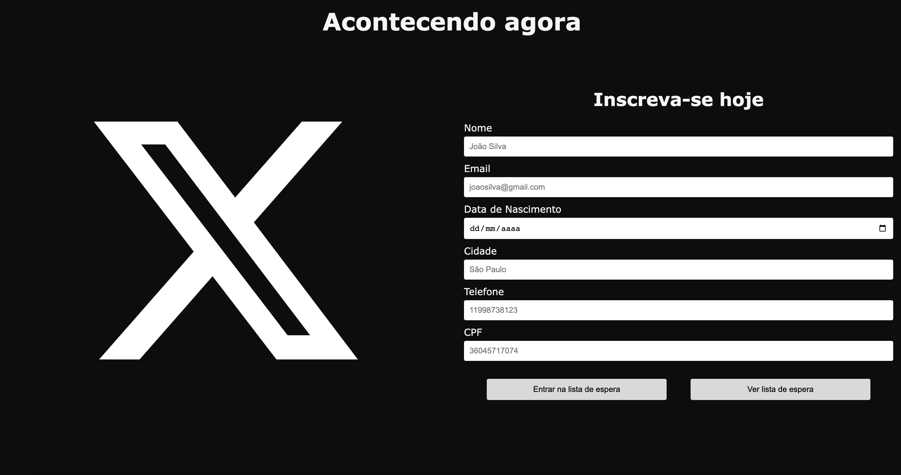

# Sistema de Cadastro de Usuários

Este é um sistema de cadastro de usuários desenvolvido em JavaScript que permite registrar informações básicas dos usuários, como nome, email, data de nascimento, endereço, telefone e CPF. Além disso, o sistema calcula a idade do usuário, determina o signo com base na data de nascimento e verifica se o usuário é um possível cliente com base na faixa etária.

## Funcionalidades

### 1. Cadastro de Usuários

Os usuários podem preencher um formulário com as seguintes informações:
- Nome
- Email
- Data de nascimento
- Endereço
- Telefone
- CPF

Ao preencher o formulário e clicar em "Cadastrar", os dados do usuário são validados e, se estiverem corretos, o usuário é adicionado à lista de espera. Caso contrário, mensagens de erro são exibidas.

### 2. Visualização de Usuários Cadastrados

Os usuários cadastrados podem ser visualizados clicando no botão "Visualizar Usuários". Isso exibirá uma lista de todos os usuários cadastrados, incluindo as seguintes informações:
- Nome
- Idade
- Signo
- Email
- Data de nascimento
- Cidade
- Telefone
- CPF
- Possível cliente (Sim ou Não)

### 3. Validação de CPF

O sistema inclui uma função que valida o CPF inserido pelo usuário, verificando se é um CPF válido de acordo com as regras estabelecidas.

## Como Usar

1. Abra o arquivo HTML em um navegador da web.
2. Preencha o formulário com as informações do usuário.
3. Clique em "Cadastrar" para adicionar o usuário à lista de espera.
4. Para visualizar os usuários cadastrados, clique em "Visualizar Usuários".

## Classes e Funções

O sistema consiste em duas classes principais:

### 1. `User`

Esta classe representa um usuário e inclui métodos para calcular a idade, determinar o signo e verificar se o usuário é um possível cliente.

### 2. `AllUsers`

Esta classe gerencia todos os usuários cadastrados e inclui métodos para adicionar um novo usuário, obter todos os usuários e contar o número total de usuários.

## Funções Auxiliares

Além das classes, existem várias funções auxiliares que realizam tarefas como formatar datas, formatar CPFs e números de telefone, validar CPFs e exibir mensagens de erro ou sucesso.

## Requisitos

Para executar este sistema, você só precisa de um navegador da web que suporte JavaScript.

